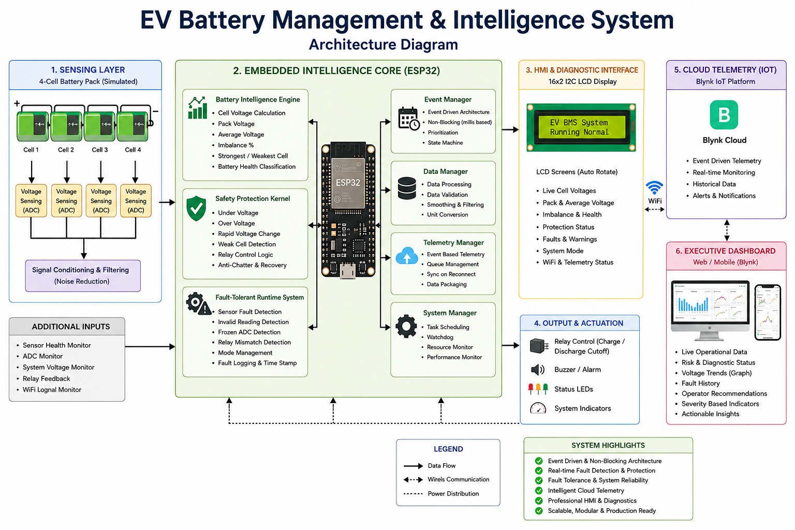
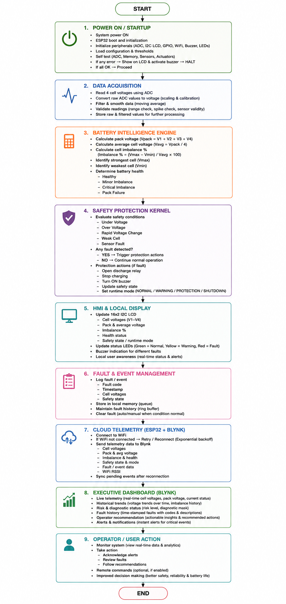
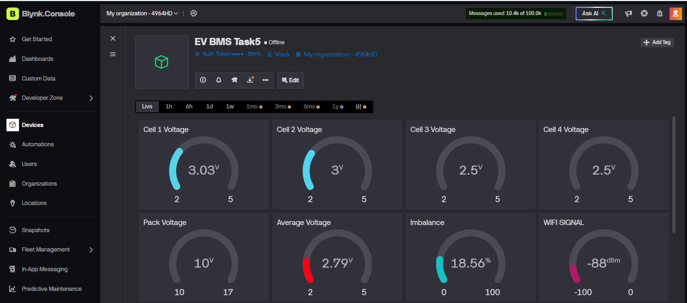
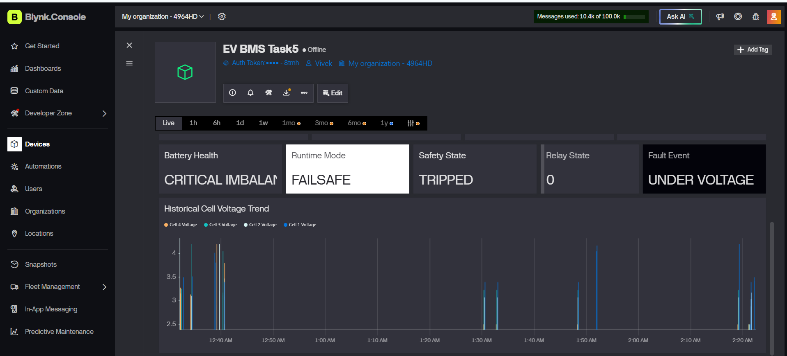

# 🔋 Intelligent EV Battery Management System

### ⚡ ESP32-Based | Wokwi Simulation | Blynk IoT | Embedded Battery Intelligence

<p align="center">
  
</p>

<p align="center">
  <b>Intelligent, Event-Driven and Fault-Tolerant EV Battery Management System</b>
</p>

---

## 📌 Project Overview

The **Intelligent EV Battery Management System (EV-BMS)** is an integrated
ESP32-based battery monitoring and protection system developed as part of
the Elevance Skills internship.

The system monitors a simulated **4-cell lithium battery pack**, performs
battery intelligence and safety analysis, detects faults, provides local
LCD diagnostics, communicates with the Blynk IoT cloud, and presents the
overall battery condition through an executive dashboard.

The complete system integrates all **six internship tasks into a single
Wokwi project**.

---

## 🎯 Project Objectives

- 🔋 Monitor individual cell voltages in real time.
- 📊 Calculate pack voltage, average voltage and cell imbalance.
- 🛡️ Detect and respond to battery safety conditions.
- ⚠️ Detect sensor and runtime faults.
- 📟 Provide real-time LCD-based diagnostics.
- ☁️ Implement event-driven Blynk cloud telemetry.
- 📈 Provide an executive-level battery monitoring dashboard.

---

# 🏗️ System Architecture

<p align="center">
   
</p>

# 🔄 System Workflow

<p align="center">
  
</p>

### Main System Layers

```text
🔋 Battery Sensing
        ↓
🧠 ESP32 Embedded Intelligence
        ↓
🛡️ Safety & Fault Management
        ↓
📟 HMI & Diagnostics
        ↓
☁️ Blynk Cloud Telemetry
        ↓
📊 Executive Dashboard
```


---

# 📊 Blynk IoT Dashboard

<p align="center">
  
</p>

<p align="center">
  
</p>

<p align="center">
  
</p>


